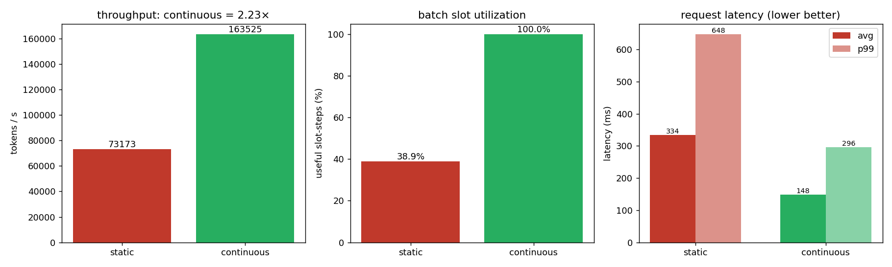

# kvcache — CUDA KV cache + decode attention + PagedAttention 对比

从零实现 decode 阶段的 attention 与 KV cache，并复现 **PagedAttention** 的核心权衡：
用一点单步延迟换取数倍的显存效率与并发能力。所有 kernel 手写 CUDA，CPU 端 numpy 对拍验证正确性。

GPU: RTX 3060 (sm_86) · CUDA 12.6 · 单卡。

---

## 目录

| 文件 | 作用 |
|------|------|
| `src/kv_cache.cu` | `append_kv`：把单个 token 的 K/V 写入连续 cache `[H,S,D]` |
| `src/decode_attn.cu` | 单序列 decode attention（连续布局，串行 softmax） |
| `src/baseline.cu` | `recompute_attn`：模拟“没有 KV cache”，每步重算 K 投影（O(t²)） |
| `src/paged.cu` | 单序列 **paged** decode：物理池 `[NB,H,BLOCK,D]` + `block_table` 间接寻址 |
| `src/batched.cu` | **多序列**批量 decode（连续 / 分页两版），softmax 改 **block 内并行 reduce** |
| `src/include/block_alloc.h` | 物理块分配器（free-list），paged 显存管理的核心 |
| `src/main.cu` / `src/main_paged.cu` | 正确性测试（对拍 `ref/ref_attn.py`） |
| `src/bench.cu` | 基准①：连续 cache vs 重算（为什么需要 KV cache） |
| `src/bench_paged.cu` | 基准②：单序列 连续 vs 分页 延迟（paged 的代价） |
| `src/bench_throughput.cu` | 基准③：多序列变长 显存 / 并发 / 吞吐（paged 的价值） |
| `src/include/scheduler.h` | **continuous batching 调度器**：waiting/running 队列 + 每步重组 batch + 真跑 paged kernel |
| `src/bench_continuous.cu` | 基准④：continuous vs static batching（吞吐 / 延迟 / slot 利用率） |
| `ref/ref_attn.py` / `ref/plot.py` | numpy 参考实现 / 画图 |

---

## 构建 & 运行

```bash
conda activate vllm                      # 提供 nvcc 12.6
cmake -S . -B build -DCMAKE_CUDA_ARCHITECTURES=86
cmake --build build -j

python ref/ref_attn.py                   # 生成对拍数据 data/*.bin
./build/kvcache                          # 连续 decode 正确性
./build/paged ;  SHUFFLE=1 ./build/paged # 分页正确性（含打乱 block table）

./build/bench          > data/bench.csv          # 基准①
./build/bench_paged    > data/bench_paged.csv     # 基准②
./build/bench_throughput                          # 基准③（写 data/throughput_summary.csv）
./build/continuous                                # 基准④（写 data/continuous_summary.csv）
python ref/plot.py                                # 出图到 data/*.png
```

`bench_throughput` 可调环境变量：`NSEQ`（并发序列数，默认 128）、`LMAX`（最大长度，默认 2048）、`BUDGET_MB`（显存预算，默认 4096）。

`continuous` 可调：`NREQ`（请求数 256）、`BATCH`（最大批宽 32）、`PROMPT_MAX`（256）、`GEN_MAX`（输出上限 512）、`BUDGET_MB`（KV 池 2048）、`ARRIVAL_RATE`（到达率 req/s，默认 0＝离线饱和；>0 则按泊松过程在线到达）。

---

## 结果（RTX 3060）

### ① 为什么需要 KV cache
重算把每步 attention 从 O(t) 变成 O(t²)；seq_len=1024 时 KV cache 快 **~24×**。

### ② 单序列 paged 的代价（`bench_paged`）
`block_table` 间接寻址带来固定开销，随长度增大：

| seq_len | 连续 µs | 分页 µs | 开销 |
|--:|--:|--:|--:|
| 128 | 21.9 | 27.2 | +24% |
| 1024 | 139.6 | 222.3 | +59% |
| 4096 | 507.6 | 881.1 | +74% |

两条路径输出逐元素一致（max abs diff = 0）。

### ③ 多序列变长的价值（`bench_throughput`，N=128，长度偏向短，mean≈650）


| 方案 | 预留显存 | 实际占用 | 利用率 | 单步 | tokens/s |
|--|--:|--:|--:|--:|--:|
| 连续 | 1024 MB | 325 MB | **31.7%** | 1340 µs | 95.5k |
| 分页 | 329 MB | 329 MB | **100%** | 1454 µs | 88.0k |

- **显存**：连续必须按 `max_seq_len` 给每条序列预留 → 短序列大量浪费；paged 按 block 实占 → **省 3.1×**。
- **并发**：固定 4096 MB 预算，连续能放 512 条，paged 能放 **1598 条（3.1×）**。
- **代价**：同 batch 下 paged 吞吐 = 连续的 **0.92×**（间接寻址）。

**结论**：paged attention 用 ~8% 单步延迟，换 3.1× 显存效率与并发上限——这是 vLLM 把吞吐做高的关键。单序列基准（②）只看得到代价，多序列变长压测（③）才看得到价值。

### ④ continuous vs static batching（`bench_continuous`，NREQ=256，BATCH=32，输出长度方差大）

调度器（`scheduler.h`）维护 `waiting / running` 队列：**每个 decode step 之前**退场已完成的序列（立刻归还物理块）、补进已到达的新请求，让 batch 始终接近满载。对照组 static 是 request-level 批处理——一组请求一起跑，必须等组内**最长**序列结束才换下一组，早完成的序列仍占着 slot 空转。两者跑同一条 trace、同一套 paged kernel，每步实测 GPU 延迟；计时区分墙钟 `wall_us`（含等待空闲）与 GPU 忙时 `gpu_us`。



**离线饱和**（`ARRIVAL_RATE=0`，请求 t=0 全就位）——看吞吐：

| 方案 | 迭代数 | makespan | tokens/s | slot 利用率 | 平均延迟 | P99 延迟 |
|--|--:|--:|--:|--:|--:|--:|
| static | 3898 | 662 ms | 73.3k | **38.9%** | 333 ms | 647 ms |
| continuous | 1701 | 298 ms | 162.7k | **100%** | 149 ms | 298 ms |

- **吞吐**：continuous 比 static 快 **2.2×**，平均与 P99 延迟同样降到约一半。
- **slot 利用率**：static 的 batch 宽度恒为 32，但只有 38.9% 的 slot-step 在真正生成（其余是等长序列的空转）；continuous 随完随补做到 100%。
- 两者生成的总 token 数相同（≈48.5k），差异纯粹来自调度：static 把迭代数浪费在“等最长序列”上。

**在线泊松**（`ARRIVAL_RATE=400`，请求按 400 req/s 陆续到达）——负载未饱和，吞吐受到达率约束而趋同，差异转移到**延迟**：

| 方案 | avg_batch | slot 利用率 | 峰值块 | 平均延迟 | P99 延迟 |
|--|--:|--:|--:|--:|--:|
| static | 20.6 | 38.4% | 665 | 63.0 ms | 149 ms |
| continuous | 5.5 | 100% | 269 | **17.0 ms** | **53.9 ms** |

- **延迟**：continuous 平均延迟 **3.7×**、P99 **2.8×** 优于 static——请求一到就能被塞进当前 batch，不必等整组结束。
- continuous 的 `avg_batch` 只有 5.5、峰值块 269（来一个处理一个、不囤积）；static 攒到 20.6 宽才开跑、囤 665 块。

**结论**：输出长度方差越大、在线负载越实时，static 整批等待的浪费越严重。continuous batching（iteration-level scheduling）把空转 slot 用排队中的新请求填满——离线提吞吐、在线降延迟，这是 vLLM 在 paged attention 之上把服务能力再翻倍的第二个关键。
