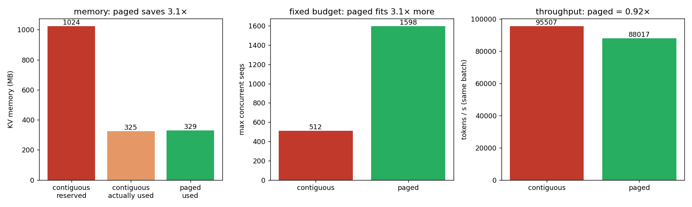

# kvcache — 手写 CUDA KV cache + decode attention + PagedAttention 对比

从零实现 decode 阶段的 attention 与 KV cache，并复现 **PagedAttention** 的核心权衡：
用一点单步延迟换取数倍的显存效率与并发能力。所有 kernel 手写 CUDA，CPU 端 numpy 对拍验证正确性。

GPU: RTX 3060 (sm_86) · CUDA 12.6 · 单卡。

---

## 目录

| 文件 | 作用 |
|------|------|
| `src/kv_cache.cu` | `append_kv`：把单个 token 的 K/V 写入连续 cache `[H,S,D]` |
| `src/decode_attn.cu` | 单序列 decode attention（连续布局，串行 softmax） |
| `src/baseline.cu` | `recompute_attn`：模拟“没有 KV cache”，每步重算 K 投影（O(t²)） |
| `src/paged.cu` | 单序列 **paged** decode：物理池 `[NB,H,BLOCK,D]` + `block_table` 间接寻址 |
| `src/batched.cu` | **多序列**批量 decode（连续 / 分页两版），softmax 改 **block 内并行 reduce** |
| `src/include/block_alloc.h` | 物理块分配器（free-list），paged 显存管理的核心 |
| `src/main.cu` / `src/main_paged.cu` | 正确性测试（对拍 `ref/ref_attn.py`） |
| `src/bench.cu` | 基准①：连续 cache vs 重算（为什么需要 KV cache） |
| `src/bench_paged.cu` | 基准②：单序列 连续 vs 分页 延迟（paged 的代价） |
| `src/bench_throughput.cu` | 基准③：多序列变长 显存 / 并发 / 吞吐（paged 的价值） |
| `ref/ref_attn.py` / `ref/plot.py` | numpy 参考实现 / 画图 |

---

## 构建 & 运行

```bash
conda activate vllm                      # 提供 nvcc 12.6
cmake -S . -B build -DCMAKE_CUDA_ARCHITECTURES=86
cmake --build build -j

python ref/ref_attn.py                   # 生成对拍数据 data/*.bin
./build/kvcache                          # 连续 decode 正确性
./build/paged ;  SHUFFLE=1 ./build/paged # 分页正确性（含打乱 block table）

./build/bench          > data/bench.csv          # 基准①
./build/bench_paged    > data/bench_paged.csv     # 基准②
./build/bench_throughput                          # 基准③（写 data/throughput_summary.csv）
python ref/plot.py                                # 出图到 data/*.png
```

`bench_throughput` 可调环境变量：`NSEQ`（并发序列数，默认 128）、`LMAX`（最大长度，默认 2048）、`BUDGET_MB`（显存预算，默认 4096）。

---

## 结果（RTX 3060）

### ① 为什么需要 KV cache
重算把每步 attention 从 O(t) 变成 O(t²)；seq_len=1024 时 KV cache 快 **~24×**。

### ② 单序列 paged 的代价（`bench_paged`）
`block_table` 间接寻址带来固定开销，随长度增大：

| seq_len | 连续 µs | 分页 µs | 开销 |
|--:|--:|--:|--:|
| 128 | 21.9 | 27.2 | +24% |
| 1024 | 139.6 | 222.3 | +59% |
| 4096 | 507.6 | 881.1 | +74% |

两条路径输出逐元素一致（max abs diff = 0）。

### ③ 多序列变长的价值（`bench_throughput`，N=128，长度偏向短，mean≈650）



| 方案 | 预留显存 | 实际占用 | 利用率 | 单步 | tokens/s |
|--|--:|--:|--:|--:|--:|
| 连续 | 1024 MB | 325 MB | **31.7%** | 1340 µs | 95.5k |
| 分页 | 329 MB | 329 MB | **100%** | 1454 µs | 88.0k |

- **显存**：连续必须按 `max_seq_len` 给每条序列预留 → 短序列大量浪费；paged 按 block 实占 → **省 3.1×**。
- **并发**：固定 4096 MB 预算，连续能放 512 条，paged 能放 **1598 条（3.1×）**。
- **代价**：同 batch 下 paged 吞吐 = 连续的 **0.92×**（间接寻址）。

**一句话结论**：paged attention 用 ~8% 单步延迟，换 3.1× 显存效率与并发上限——这正是 vLLM 把吞吐做高的关键。单序列基准（②）只看得到代价，必须上多序列变长压测（③）才看得到价值。

---

## 已知简化 / 下一步

- **kernel 占用率**：`blockDim = D = 64`，一个 block 仅 64 线程，占用率偏低；提升需把点积改成 warp 协作。
- **FP16/BF16**：当前纯 FP32；真实 KV cache 用半精度，访存量减半。
- **online softmax（FlashAttention 风格）**：现在把整行 `score` materialize 进 shared memory，受序列长度限制；可改成边算边归约。
- **真实系统对标**：环境已装 vLLM 0.9.2，可把手写 kernel 与 vLLM 的 PagedAttention 放同一张图。
- **动态增长**：`block_alloc.h` 已支持按需 alloc/free，但 benchmark 目前一次性建表；可加逐 token append + 序列结束回收的完整 decode 循环。
